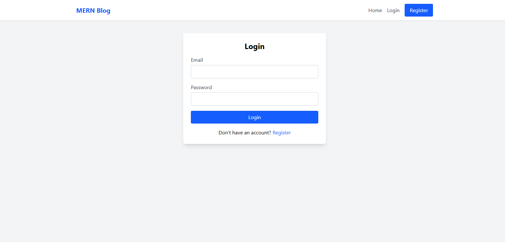
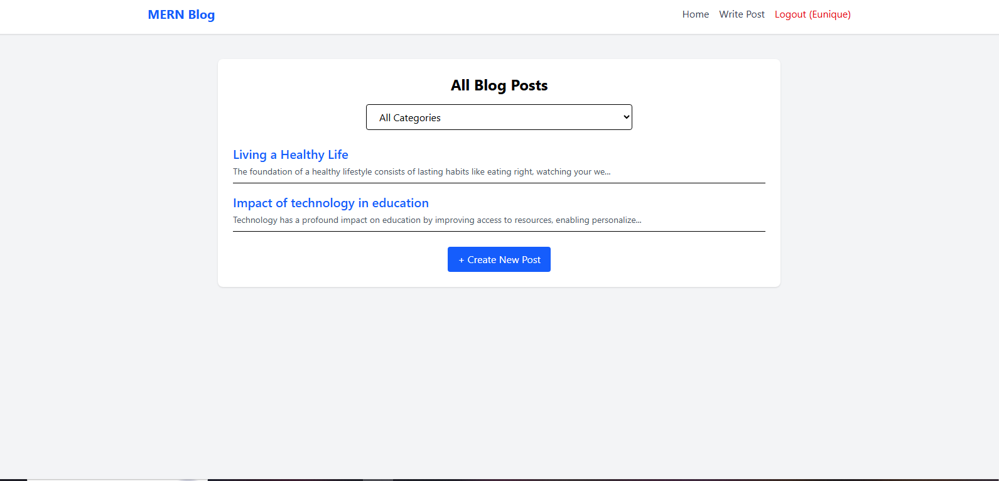
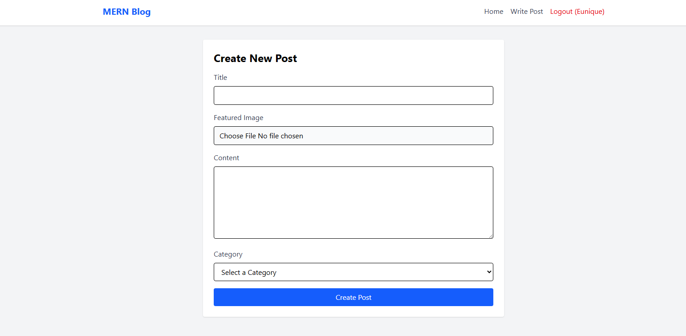

# Blog App (MERN)

This repository contains a full-stack blog application built with the MERN stack (MongoDB, Express, React, Node). The app includes user authentication, post CRUD, image upload support, and a React front-end with a Vite dev setup.

**Quick Links**

- **Project root**: `./`
- **Client**: `./client`
- **Server**: `./server`

**Screenshots**





**Features**

- **CRUD posts**: Create, read, update, and delete blog posts.
- **Authentication**: User registration and login with protected routes.
- **Image uploads**: Upload images for posts (stored in `uploads/`).
- **REST API**: Express + MongoDB (Mongoose) back-end.
- **React + Vite**: Fast front-end development with Vite.

**Project Structure**

- **`client/`**: React front-end (Vite)
- **`server/`**: Express back-end, routes, controllers, models
- **`uploads/`**: Uploaded images (server-side static files)

**Tech Stack**

- **Front-end**: React, Vite, Tailwind CSS (optional), React Router
- **Back-end**: Node.js, Express, MongoDB, Mongoose
- **Auth**: JSON Web Tokens (JWT) and middleware for protected routes
- **File upload**: `multer`

**Local Setup**

1. Clone the repository and open the project root.

2. Install dependencies for both server and client.

   - Server (from `server/`):

     ```powershell
     cd server
     npm install
     ```

   - Client (from `client/`):
     ```powershell
     cd client
     npm install
     ```

3. Environment variables

- Create a `.env` file in `server/` (example variables below):

```
PORT=5000
MONGO_URI=your_mongodb_connection_string
JWT_SECRET=your_jwt_secret
```

4. Run the apps locally

- Start the server (from `server/`):

  ```powershell
  cd server
  npm run dev
  ```

- Start the client (from `client/`):
  ```powershell
  cd client
  npm run dev
  ```

By default the client runs on `http://localhost:5173` (Vite) and the server runs on `http://localhost:5000` (adjust ports via `.env` or scripts).

**Available Scripts**

- Server: `npm run dev` (nodemon), `npm start` (node)
- Client: `npm run dev` (vite), `npm run build`, `npm run preview`

**Deployment Notes**

- For deployment, build the client (`cd client && npm run build`) and serve the static `dist/` from the server (or host the client separately). Ensure `MONGO_URI` and `JWT_SECRET` are set in production environment variables.

**Useful Files**

- Server entry: `server/src/server.js`
- Client entry: `client/src/main.jsx`
- API helper: `client/src/services/api.js`
